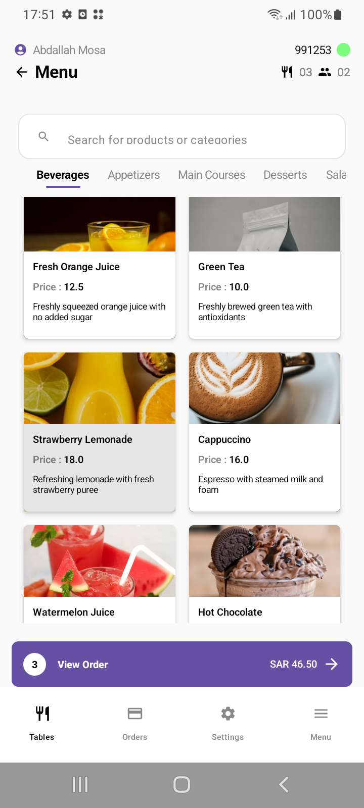
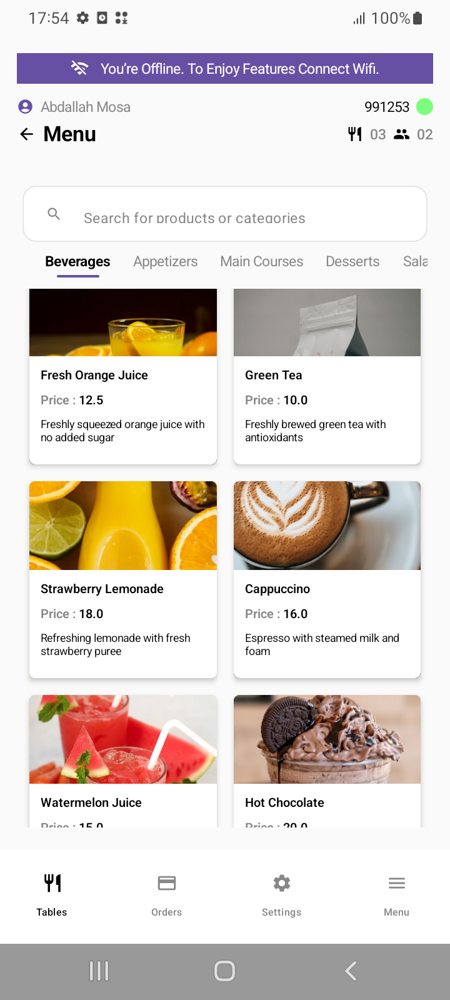

# Foodics Order App 🍕

A modern Android application for browsing products and managing orders .

## ✨ Features

- **Browse Products** - View products organized by categories
- **Search Functionality** - Real-time search across products
- **Add to Cart** - Single tap to add products to order
- **Offline Support** - Works without internet using local database
- **Order Management** - View order total and item count

## 🛠️ Built With

- **Jetpack Compose** 
- **MVI Architecture**
- **Clean Architecture** 
- **Room Database** 
- **KTOR** 
- **KOIN** - Dependency injection
- **Material Design 3** - Modern UI components

## 📱 Screens

### Main Screens
- **Menu Screen** - Browse products, search, and add to cart
- **Orders Screen** - View order history (placeholder)
- **Settings Screen** - App configuration (placeholder)

## 🔄 Offline Support

- **Automatic Caching** - All data saved to local database
- **Offline Indicator** - Shows when internet is unavailable
- **Seamless Experience** - Works without internet connection
- **Data Persistence** - Orders persist between app sessions

*Note: When offline, the app displays cached data from local database

## 🎨 UI Features

- **Smooth Animations** - Animated transitions and effects
- **Shimmer Loading** - Beautiful loading states
- **Responsive Design** - Adapts to different screen sizes
- **Portrait Mode** - Optimized for portrait orientation

| Main Screen  | Offline Mode |
|-------------|-------------|
|  |   |

